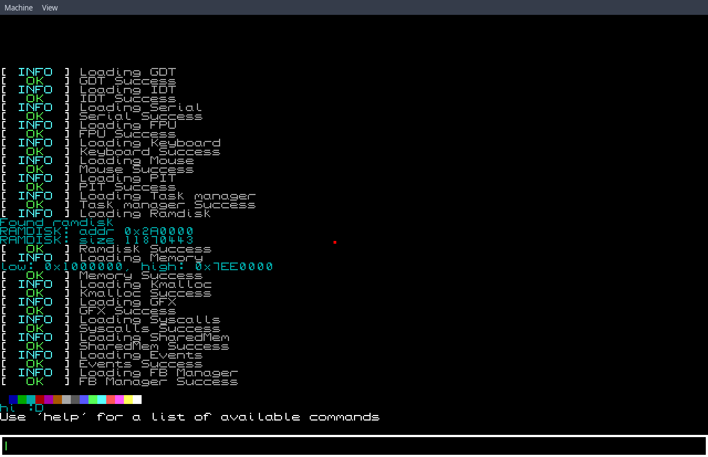
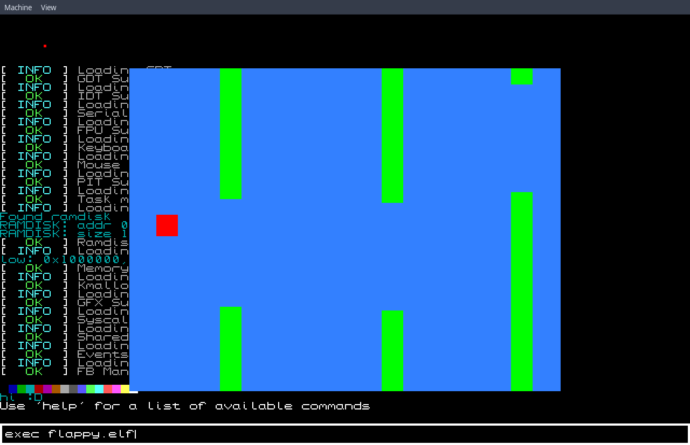
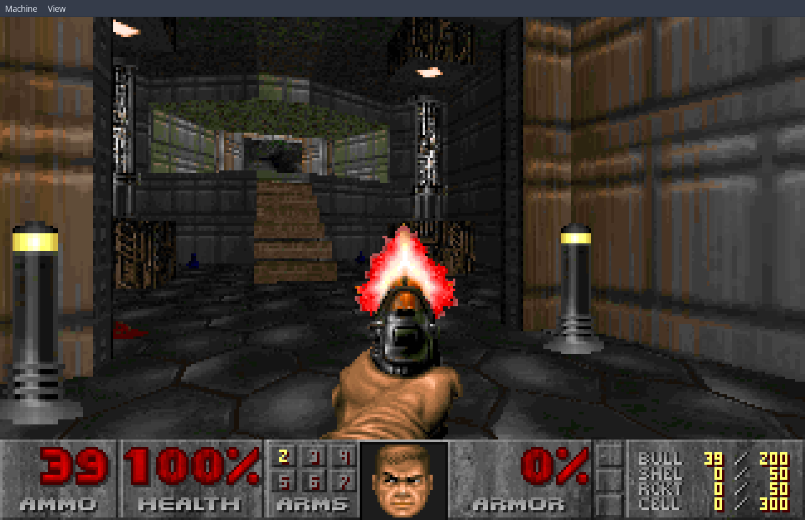
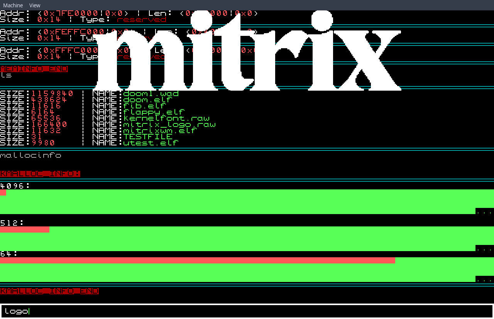

# Mitrix - My own little OS :)

⚠️
This OS is not meant to be used and it's only purpose
is to be a fun project for me to work on and learn from.
⚠️

Mitrix is a x86 Operating System with a monolithic kernel.
It supports:
- A very basic filesystem called MIFS
- Mouse
- Keyboard
- Timer (PIT)
- Paging
- Serial logging
- Shared Memory
- Userspace execution
- Multitasking
- EFL32 executables
- Syscall API for userspace
- Doomgeneric port for Mitrix
- Basic shell (VTTY like)

### Pictures






### Building

```sh
# Build the toolchain
chmod +x ./toolchain/build_tools.sh
./toolchain/build_tools.sh
# Compile the project
make all
```

### Running

After building you can use this to run the OS in QEMU:
```sh
make run
```
The ISO file will be available at `build/mitrix.iso` so
you could burn it on an USB and try it on real hardware.

### Editing Environment

This project supports `compile_commands.json` for LSP servers:
```sh
make gen_cc_json
```

### Project Structure

    .
    ├── build         # Build files
    ├── ramdisk       # Folder which will get packed into an MIFS ramdisk image
    ├── src           # Source files
    ├── toolchain     # Build folder for gcc/binutils i686-elf toolchain
    ├── tools         # Tools (compiled on host)
    │   └── mifs.c    # Utility to creating MIFS images
    ├── userspace     # Userspace programs (can be executed within Mitrix)
    │   ├── bin       # Destination of compiled programs
    │   ├── doom...   # Doomgeneric port to Mitrix
    │   ├── fib       # Generate fibonacci sequence
    │   ├── flappy    # Very basic flappy bird
    │   ├── libc      # Libc port
    │   ├── libgfx    # Very basic GFX library
    │   ├── libmitrix # Userspace OS API bindings (f.e.: wrappers for syscalls)
    │   ├── utest     # Place for testing new features
    │   └── ...
    └── ...

### Todo

- [ ] Rework tasking with multiple framebuffers
- [ ] Add Window Manager
- [ ] Maybe port to x86_64
- [ ] Move to musl-libc
- [ ] Port binutils + gcc
